## {data-background-image="images/title.png" data-background-size="cover"}

## Why we need to set up?

:::{.incremental}
- This is a hands-on workshop $\xrightarrow{}$ we'll be coding a bunch of stuff
- Working with code $\xrightarrow{}$ version control nightmare
:::

. . .

### What I mean?

::: {.fragment}
``` {.python code-line-numbers="true"}
import torch

scaler = torch.cuda.amp.GradScaler()
```
:::

::: {.fragment}
works fine for `PyTorch >= 1.6`
:::

::: {.fragment}
but for `PyTorch >= 2.4` we get

``` {.bash code-line-numbers="false"}
ModuleAttributeError: module 'torch.cuda.amp' has no attribute 'GradScaler'
```
:::

::: {.fragment}
### Why?
:::

::: {.fragment}
because in `PyTorch 2.4`, `GradScaler` was relocated to `torch.amp.Gradscaler`
:::

## Why we need to set up?

<br/>

::: {.incremental}
- We will also be working together $\xrightarrow{}$ so we need to be on the same page
- So that all our bugs bug us equally 😄
:::

. . .

<br/>

### How can we all be on the same page?

::: {.incremental}
- We all work on the same environment
- We all work with the same software stack
:::

::: {.fragment}
### It also makes life much easier for us!! 😅
:::

## How can we be on the same environment?

::: {.incremental}
- We use <em>Marvin</em>!!
:::

<br/>

::: {.fragment}
<em>Marvin</em> is a State of the Art (for 2022) Tier 3 HPC cluster at the University of Bonn
:::

::: {.incremental}
- We have created temporary accounts on Marvin for all of you
  - you should have received an email (please say now if you haven't)
- We have also reserved a few nodes for the workshop
- We will be doing everything on Marvin remotely
:::

<br/>

::: {.fragment}
### A huge thanks to the HPC Team of Uni Bonn!
:::

## How do we work remotely on Marvin?

::: {.incremental}
- Using <em>SSH</em> (Secure Shell)
- For that we need to set up a SSH key pair for you to access Marvin securely
:::

::: {.fragment}
Open `Terminal` on your laptop and type the following command

``` {.bash code-line-numbers="false"}
ssh-keygen -t ed25519
```
:::

::: {.fragment}
you will be asked to enter a file name to save the key

``` {.bash code-line-numbers="false"}
Generating public/private ed25519 key pair.
Enter file in which to save the key (/home/<username>/.ssh/id_ed25519):
```
:::

::: {.fragment}
you will also be asked to enter a passphrase

``` {.bash code-line-numbers="false"}
Enter passphrase for "/home/<username>/.ssh/id_ed25519" (empty for no passphrase):
```

::: {style="color: red !important;"}
IMPORTANT!! Please enter a strong passphrase and remember it, otherwise you won't be able to access Marvin
:::
:::

## Providing the public key to Marvin

::: {.incremental}
- Go to the Marvin user portal: <a href="https://freeipa.hpc.uni-bonn.de/" target="_blank">https://freeipa.hpc.uni-bonn.de/</a>
- Log in with the credentials you received via email from HPC@UniBonn
:::

::: {.columns}
::: {.column width="30%" .fragment}
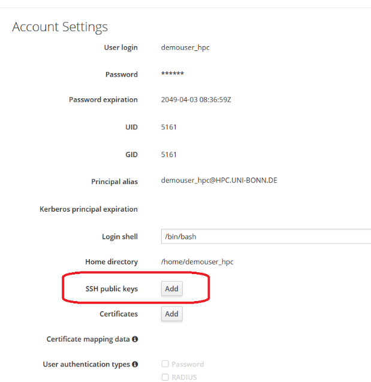{width=100%}
:::
::: {.column width="40%"}
::: {.incremental}
- Click on `SSH public keys -> Add` on the right side of the page
- Copy the content of your public key file (e.g., `~/.ssh/id_ed25519.pub`) and paste it into the `Public key` field
:::
:::
::: {.column width="30%" .fragment}
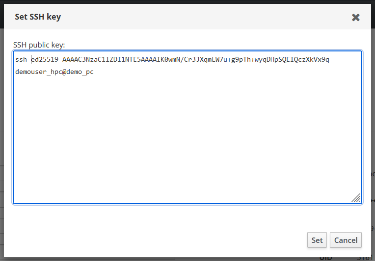{width=100%}

::: {.incremental}
- Click on `Set` to save the public key
:::
:::
:::

## Providing the public key to Marvin

- Go to the Marvin user portal: <a href="https://freeipa.hpc.uni-bonn.de/" target="_blank">https://freeipa.hpc.uni-bonn.de/</a>
- Log in with the credentials you received via email from HPC@UniBonn

::: {.columns}
::: {.column}
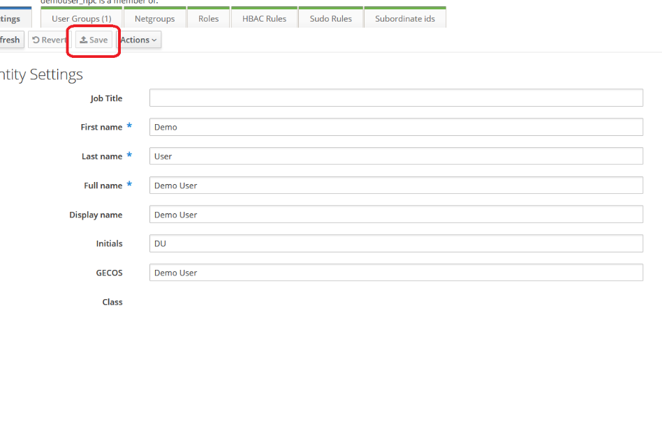{width=100%}
:::
::: {.column}
And finally, click `Save` in the top left bar to save the changes to your account

::: {style="color: red !important;" .fragment}
If something went wrong, please tell us now!
:::
:::
:::

## Set up an SSH config file

::: {.incremental}
- To make it easier to connect to Marvin, we will set up an SSH config file on your laptop
- This will allow us to connect to Marvin using a simple command like `ssh marvin` instead of `ssh -i /path/to/your/private/key <username>@marvin.hpc.uni-bonn.de`
:::

<br/>

::: {.fragment}
Create a file named `config` in the `~/.ssh/` directory (if it doesn't already exist)
:::

::: {.fragment}
And add the following content to the `config` file

``` {.bash code-line-numbers="false"}
Host marvin
  HostName marvin.hpc.uni-bonn.de
  User <username>
  IdentityFile /path/to/your/private/key (e.g., ~/.ssh/id_ed25519)
  IdentitiesOnly yes
```
:::

## Let's test it out!

::: {.fragment}
Open a new terminal and type the following command

``` {.bash code-line-numbers="false"}
ssh marvin
```
:::

::: {.fragment}
If everything is set up correctly, you will be greeted with this
:::

<br/>

::: {.columns}
::: {.column width="40%" .fragment}
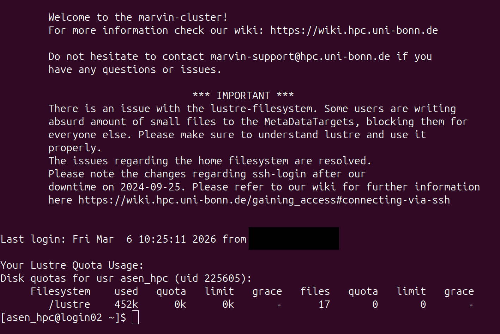{width=100%}
:::
::: {.column width="60%" .fragment}
Let us know now if you do not see this welcome message after running `ssh marvin`
:::
:::

## Let's create a workspace for you!

<br/>

::: {.fragment}
In the terminal where you are connected to Marvin, run the following command to create a workspace for you
``` {.bash code-line-numbers="false"}
wget -O create_workspace_polyglot.sh https://tinyurl.com/polyglot-st-cr \
  && chmod +x create_workspace_polyglot.sh \
  && ./create_workspace_polyglot.sh
```
:::

::: {.fragment}
This will create a workspace for you in the `/lustre/scratch/data/<username>-polyglot` directory
:::

<br/>

::: {.fragment}
Next we will set up some environment variables that will be useful for us later on
:::


## Setting up environment variables

::: {.fragment}
In the terminal where you are connected to Marvin, run the following command to set up the environment variables
``` {.bash code-line-numbers="false"}
wget -O set_env_vars_polyglot.sh https://tinyurl.com/polyglot-st-env \
  && source set_env_vars_polyglot.sh
```
:::

::: {.fragment}
This will set up the following environment variables for you:
:::

::: {.incremental}
- `WS_DIR`: the directory of your workspace (e.g., `/lustre/scratch/data/<username>-polyglot`)
- `cdws`: a shortcut command to change to your workspace directory (i.e., `cd $WS_DIR`)
- `WS_COMMON` : the directory of the common files that we will be using in the workshop (`/lustre/scratch/data/nklugeco_hpc-workshop`)
- `sbatch_poly` : a shortcut command to submit a job to the cluster using the correct reservation and account (`sbatch --reservation=polyglot_[mon,tue...] --account=tmp_polyglot`)
:::

## Setting up environment variables

::: {.fragment}
To make the environment variables available throughout the workshop, we add it to your `.bashrc`
(this is a script that runs every time you log in to Marvin)
``` {.bash code-line-numbers="false"}
echo "source ~/set_env_vars_polyglot.sh" >> ~/.bashrc
```
:::

::: {style="color: red !important;" .fragment}
Its completely understandable if you don't want to do this (especially if you already use Marvin regularly)
:::

::: {.fragment}
In that case, you need to run the following every time you start a new session on Marvin
``` {.bash code-line-numbers="false"}
source ~/set_env_vars_polyglot.sh
```
:::

<br/>

::: {.fragment}
That was a lot of setup (and working with a terminal can be intimidating), so let's take a break!!
:::

## Let's make things slightly easier for you!

::: {.fragment}
Working with the terminal can be intimidating, especially if you are not used to it
:::

::: {.fragment}
To make things easier for you, we would do everything through `VSCode`
:::

::: {style="color: red !important;" .fragment}
This is completely optional, you can still follow along using the terminal if you prefer
:::

::: {.fragment}
You can download `VSCode` from the official website: <a href="https://code.visualstudio.com/download" target="_blank">https://code.visualstudio.com/download</a>
:::

::: {.fragment}
Choose the option that suits your system

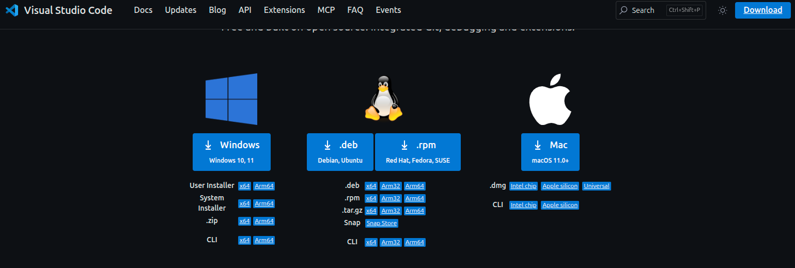{width=50%}

Feel free to ask us for help if you are not sure which one to choose
or if you have any issues installing `VSCode`
:::

## Remote development with VSCode

::: {.fragment}
`VSCode` has a great extension called `Remote - SSH` that allows you to connect to a remote server (like Marvin) 
and work with the files on that server as if they were on your local machine
:::

::: {.columns}
::: {.column width="40%" .fragment}
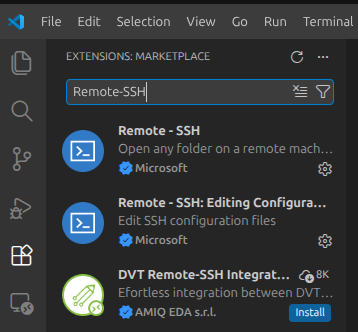{width=100%}
:::
::: {.column width="60%" .fragment}
Got to the extensions tab in `VSCode` and search for `Remote - SSH` and install it

::: {.fragment}
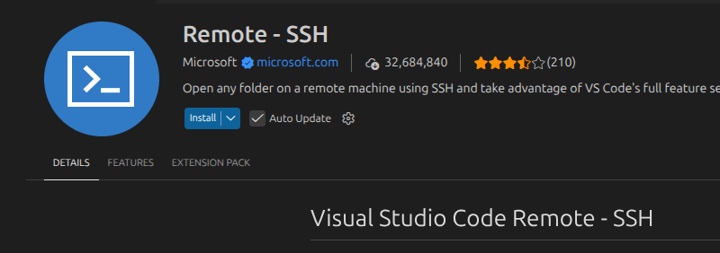{width=100%}
:::
:::
:::

## Connecting to Marvin with VSCode

::: {.fragment}
On `VSCode`, press `F1` or `Ctrl + Shift + P` to open the command palette and type

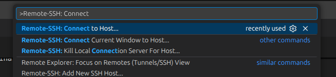{width=60%}
:::

::: {.fragment}
Select `marvin` from the list of hosts (if you have many)

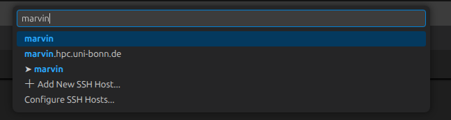{width=60%}
:::

::: {.fragment}
If all our previous steps were successful, you should be now running a `VSCode` server on Marvin
:::

## Setting up VSCode for remote development

::: {.fragment}
Now that we are connected to Marvin with `VSCode`, we open the workspace directory that we created earlier
:::

::: {.columns}
::: {.column .fragment}
Press `Ctrl + k` followed by `Ctrl + o` (or `File -> Open Folder`) and navigate to your workspace directory

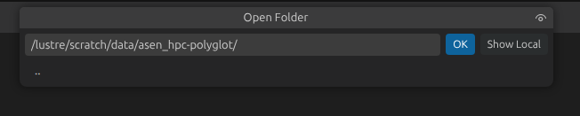{width=80%}
:::
::: {.column .fragment}
We can also open up a terminal in `VSCode` at this directory by going to `Terminal -> New Terminal` (or pressing `` Ctrl + Shift + ` ``)

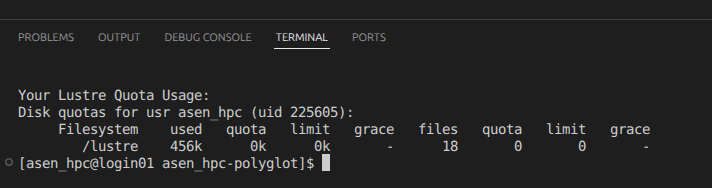{width=80%}
:::
:::

. . . 

### Perfect!! Now we are all working with the same environment 🎉

::: {.fragment}
This is going to be our main window for the rest of the workshop
:::